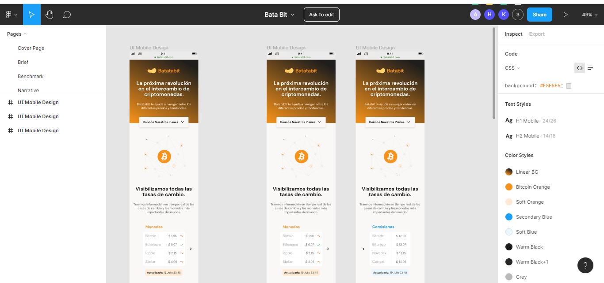
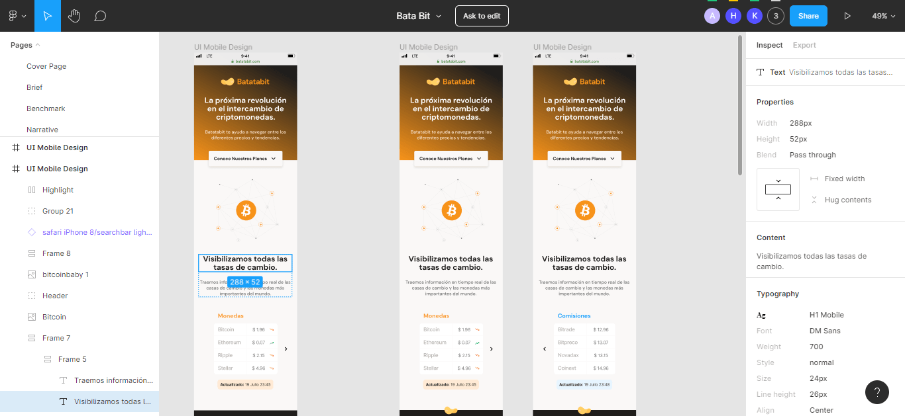

# ANALIZANDO EL DISEÑO

Para este curso se desarrolla una página real para un cliente especifico, aplicando los concepto de HTML y CSS 

Análisis del Proyecto

Para realizar el diseño de la página se utiliza la herramienta sigma, en la cuál después del diseño, de la arquitectura del proyecto se pueda pasar después a código. Se recomienda crear una cuenta en Figma, para poder ver este frame, ver todos los detalles de este diseño y se pueda comenzar con la arquitectura.

[Página en Figma](https://www.figma.com/proto/sMmlQaZldfDcLERYYWe6h4/Bata-Bit?node-id=44%3A594&scaling=scale-down)

La landing page es estática e informativa, el cuál tiene varios botones que posteriormente se pueden convertir en un call action. En principio se tiene el header con un boton flotante, que esta entre dos secciones, entre el header y el main y por último se termina con un footer con la información básica.

Al seleccionar alguna sección no muestra como 

En el lado derecho se muestra los estilos de esa parte, pero por recomendación general, es bueno crear los propios estilos en el css, cambiarlos, los estilos que si interesan mucho son las fuentes, el tamaño, el color, la tipografía.