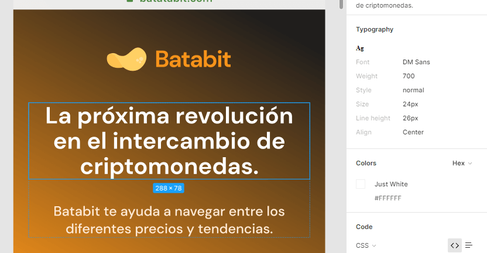
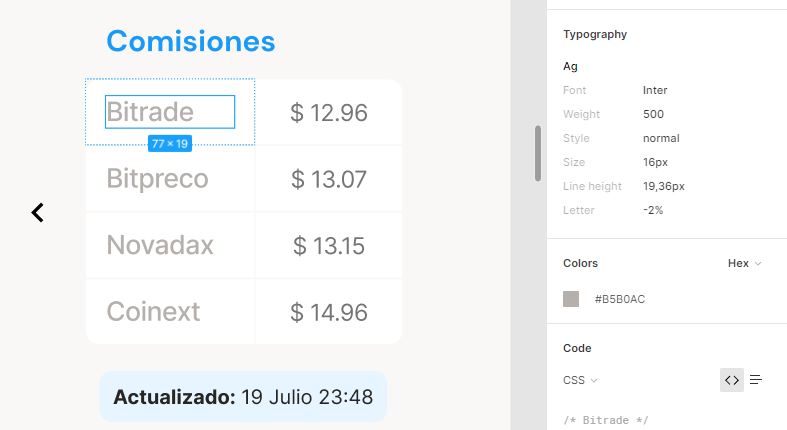
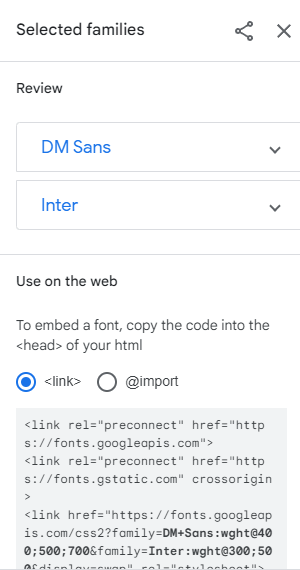

# FUENTES DE NUESTRO PROYECTO

Por buenas practicas solo se puede trabajar con máximo dos fuentes. Si existen mas de dos fuentes, se debe tratar de seleccionar las dos con las que se van a trabajar en la landing page. Las fuentes se van a descargar desde google fonts, pero primero se observan las fuentes en el diseño de Figma.

[Figma Design](https://www.figma.com/proto/sMmlQaZldfDcLERYYWe6h4/Bata-Bit?node-id=44%3A594&scaling=scale-down)

Se observa en el diseño que se maneja la fuente 'DM Sans' e 'Inter', ya conociendo estas fuentes se dirige a google fonts en donde la fuente [DM sans](https://fonts.google.com/specimen/DM+Sans?query=DM+sans) se selecciona 400, 500 y 700 y de la fuente [inter](https://fonts.google.com/specimen/Inter?query=inter) se selecciona la 300 y 500.

Despues de seleccionadas hay la opción de descargarlo por medio de un link o importarlo

Como buena práctica, no se debe importarla, lo mejor es copiar el link y pegarlo en el HTML

~~~html
<head>
    <meta charset="UTF-8">
    <meta http-equiv="X-UA-Compatible" content="IE=edge">
    <meta name="viewport" content="width=device-width, initial-scale=1.0">
    <title>Document</title>
    <!-- Link de google fonts -->
    <link rel="preconnect" href="https://fonts.googleapis.com">
    <link rel="preconnect" href="https://fonts.gstatic.com" crossorigin>
    <link href="https://fonts.googleapis.com/css2?family=DM+Sans:wght@400;500;700&family=Inter:wght@300;500&display=swap" rel="stylesheet">
</head>
~~~

y en el CSS se debe pegar este

~~~css
font-family: 'DM Sans', sans-serif;
font-family: 'Inter', sans-serif;
~~~