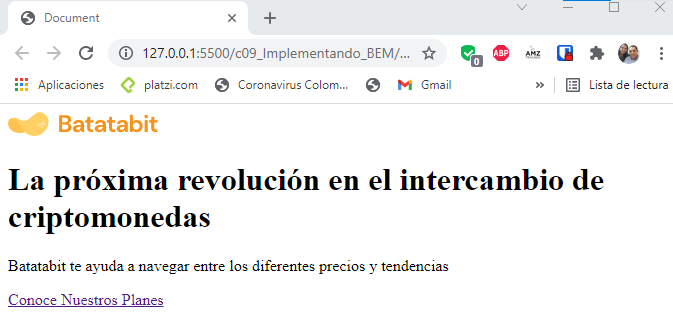

# IMPLEMENTANDO BEM

Se busca en el HTML que etiquetas pueden estar repitiendose para dentro de cada una estas etiquetas generar una clase que permitira identificarlo en el CSS como por ejemplo los buttons o tambien se coloca clases en etiquetas que son muy comunes como por ejemplo la etiqueta div

Se escribe en el body del index.HTML

~~~html
<header>
    
    <!-- Se crea la clase header, en la metodología BEM
    primero se escribe primero el bloque principal 
    (header) seguido de dos -- y despues el elemento 
    como tal (title-container) -->
    

        <h1>La próxima revolución en el intercambio de criptomonedas</h1>
        

            Batatabit te ayuda a navegar entre los diferentes precios y tendencias
        

        <!-- Se crea otra clase porque puede que se 
        tenga mas botones despues, en la metodología 
        BEM se coloca el bloque principal (header) y 
        el elemento como tal (button)-->
        <a href="" class="header--button">Conoce Nuestros Planes <i></i></a>
    

</header>
~~~

En el navegador aparece como,

Los estilos CSS para el header quedan como 

~~~css
header {
    position: relative;
    display: flex;
    flex-direction: column;
    justify-content: center;
    /* Ancho de toda la pantalla */
    width: 100%;
    /* La dimensión mas pequeñas en celulares es de 320px */
    min-width: 320px;
    /* Altura del header */
    height: 334px;
    /* Centrado de la letra */
    text-align: center;
}
~~~

Los estilos en la imagen del header esta dado por el siguiente código

~~~css
header img{
    /* Ancho de la imagen */
    width: 150px;
    /* Alto de la imagen */
    height: 24px;
    /* Margen superior */
    margin-top: 60px;
    /* Centrar la imagen en la pantalla, note que se utiliza
    align-self en vez de align-items por estar trabajando
    en flex */
    align-self: center;
}
~~~

Los estilos del texto en el header que se encuentra en la etiqueta div del HTML, se escriben en el CSS como

~~~css
/* Se llama la primera clase */
.header--title-container{
    /* Ancho del 90% de la pantalla */
    width: 90%;
    /* Ancho minimo */
    min-width: 288px;
    /* Ancho máximo */
    max-width: 900px;
    /* altura */
    height: 218px;
    /* Margen para separarlo del logotipo */
    margin-top: 40px;
    /* Se centra el texto */
    text-align: center;
    /* Se centra los contenedores del texto */
    align-self: center;
}
~~~

