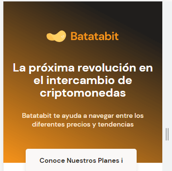

# USO DE POSITION PARA BOTÓN FLOTANTE

Lo que falta para terminar el Header en el botón flotante que se encuentra entre el header y en main.

Estilo del botón

~~~css
.header--title-container .header--button{
    position: absolute;
    /* Cuando se esta en position absolute se puede utilizar
    top, bottom, left, right para mover en esa dirección el
    contenedor*/
    top: 270px;
    /* Calc calcula el valor de una operación  */
    left: calc(50% - 118px);
    display: block;
    /* Separación desde el párrafo */
    margin-top: 35px;
    /* Espacio para despues darle el estilo de apariencia de 
    botón */
    padding: 15px;
    /* Ancho y altura del contenedor */
    width: 229px;
    height: 48px;
    /* color de fondo */
    background-color: var(--off-white);
    /* Sombras del botón */
    box-shadow: 0px 4px 8px rgba(89, 73, 30, 0.16);
    /* Borde del botón */
    border: none;
    border-radius: 5px;
    /* Tamaño de la fuente */
    font-size: 1.4rem;
    font-weight: bold;
    /* Se quita el subrayado */
    text-decoration: none;
    /* Color de la fuente */
    color: var(--black);
}
~~~

Estilos del ícono dentro del botón 

~~~css
.header--button span{
    display: inline-block;
    /* Ancho y altura del icono */
    width: 13px;
    height: 8px;
    /* Separación del texto del botón */
    margin-left: 10px;
    background-image: url('../assets/icons/down_arrow.svg');
}
~~~

