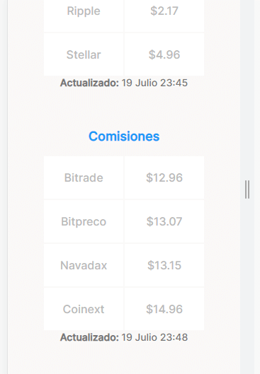

# ESTILOS BASE DE TABLA DE MONEDAS

Estilos del contenedor que contiene todo lo de monedas

~~~css
.main-currency-table {
    /* La tabla no ocupa todo el ancho de la pantalla */
    width: 70%;
    /* Tamaño minimo y máximo de la tabla */
    min-width: 235px;
    max-width: 500px;
    /* Altura del contenedor */
    height: 360px;
    /* Se centra el contenedor */
    margin: 0 auto;
    /* Se agrega la fuente, recordar que no es la misma que 
    el resto de la página, este utiliza la familia Inter, es
    caso de no encontrarlo se utiliza el sans-serif*/
    font-family: 'Inter', sans-serif;
}
~~~

Estilos del título de la tabla, por especificidad se escribe
la clase padre e hijo, ya que se tiene otra tabla similar

~~~css
.main-currency-table .currency-table--title {
    /* Separación entre el título y la tabla */
    margin-bottom: 15px;
    /* Tamaño de la fuente */
    font-size: 1.8rem;
    font-weight: bold;
    line-height: 2.3rem;
    /* Color de fuente */
    color: var(--bitcoin-orange);
}
~~~

Estilos al contenedor de tabla

~~~css
.currency-table--container{
    /* Ancho de la tabla dentro del contenedor */
    width: 90%;
    /* Anchos minimos y máximos */
    min-width: 230px;
    max-width: 300px;
    height: 250px;
    /* Se centra la tabla */
    margin: 0 auto;
}
~~~

Estilos propios de la tabla

~~~css
.currency-table--container table {
    /* Ancho y largo de la tabla de acuerdo al contenedor*/
    width: 100%;
    height: 100%;    
}
~~~

Estilos de las columnas de la tabla

~~~css
.currency-table--container td {
    /* Al ser dos columnas, cada columna ocupa el 50% de la 
    tabla */   
    width: 50%;
    /* Estilos de la fuente */
    font-size: 1.6rem;
    font-weight: 500;
    line-height: 1.9rem;
    color: var(--grey);
    /* Color de fondo */
    background-color: var(--just-white);
}
~~~

De la misma forma se agrega los estilos para la tabla de comisiones, la cual queda como.

