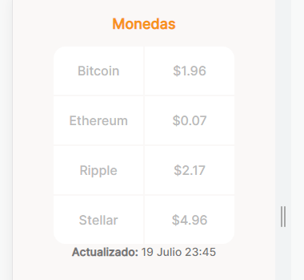
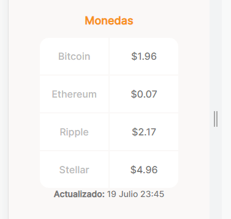
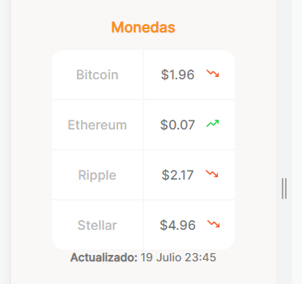
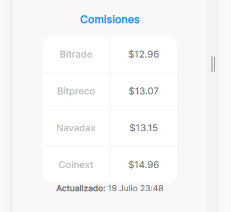

# DETALLANDO ESTILOS DE TABLA DE MONEDAS

Redondeo de la tabla

~~~css
/* Redondeo de la tabla en la esquina superior izquierdo */
.currency-table--container .table__top-left {
    border-radius: 15px 0 0 0;
}
/* Redondeo de la tabla en la esquina superior derecho */
.currency-table--container .table__top-right {
    border-radius: 0 15px 0 0;
}
/* Redondeo de la tabla en la esquina inferior izquierdo */
.currency-table--container .table__bottom-left {
    border-radius: 0 0 0 15px;
}
/* Redondeo de la tabla en la esquina inferior derecho */
.currency-table--container .table__bottom-right {
    border-radius: 0 0 15px 0;
}
~~~

Estilos a la columna derecha de la tabla

~~~css
.currency-table--container .table__right {
    /* Estilos de fuente */
    font-size: 1.4 rem;
    font-weight: normal;
    line-height: 1.7rem;
    color: #757575;
}
~~~

Estilos de las flechas de tendencia del precio

~~~css
/* Se agrega la flecha bajando al lado del precio */
.currency-table--container .down {
    /* Flecha a lado del precio */
    display: inline-block;
    /* Tamaño de la flecha */
    width: 15px;
    height: 15px;
    /* Separación del precio */
    margin-left: 10px;
    /* Se agrega la flecha */
    background-image: url('../assets/icons/trending-down.svg');
    /* La imagen ocupe todo el contenedor */
    background-size: cover;
    /* imagen centrada */
    background-position: center;
    /* No se repita la imagen */
    background-repeat: no-repeat;
}
/* Se agrega la flecha subiendo al lado del precio */
.currency-table--container .up {
    display: inline-block;
    width: 15px;
    height: 15px;
    margin-left: 10px;
    background-image: url('../assets/icons/trending-up.svg');
    background-size: cover;
    background-position: center;
    background-repeat: no-repeat;
}
~~~

De igual forma se agrega los estilos a la tabla de comisiones

