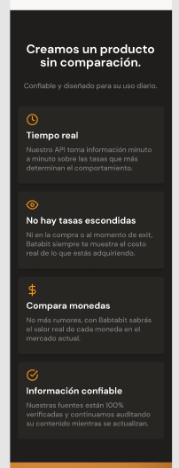

# ESTRUCTURA BASE DE LA SECCION DE BENEFICIOS

Se puede observar que esta sección tiene un color de fondo distinto, Comienza con un ícono entre la sección anterios y este, se tiene un encabezado que hace intro a esta sección, seguido de un parrafo, despues una serie de 4 tarjetas, en el cual cada tarjeta contiene un ícono, un encabezado y un párrafo con texto. La estructura HTML queda como

~~~html
<!-- Sección mostrando los beneficios de la empresa -->
<section class="main-product-detail">
    <!-- Ícono entre la sección de información de la
    moneda y la sección de beneficios -->
    
    <!-- Contenedor del texto -->
    

        <!-- Título de la sección -->
        <h2>Creamos un producto sin comparación.</h2>
        <!-- Párrafo -->
        
Confíable y diseñado para su uso diario

    

    <!-- Contenedor con las tarjetas de beneficios -->
    <section class="product-cards--container">
        <!-- Cada tarjeta se convierte en un articulo,
        en total son 4  -->
        <article class="product-detail--card">
            <!-- Ícono de la tarjeta -->
            
            <!-- Encabezado de la tarjeta -->
            
Tiempo real

            <!-- Texto de la tarjeta -->
            
Nuestro API toma información minuto a minuto sobre las tasas que más determinan el comportamiento.

        </article>
        <article class="product-detail--card">
            <!-- Ícono de la tarjeta -->
            
            <!-- Encabezado de la tarjeta -->
            
No hay tasas escondidas

            <!-- Texto de la tarjeta -->
            
Ni en la compra o al momento de exit, Batabit siempre te muestra el costo real de los que estás adquiriendo.

        </article>
        <article class="product-detail--card">
            <!-- Ícono de la tarjeta -->
            
            <!-- Encabezado de la tarjeta -->
            
Compara monedas

            <!-- Texto de la tarjeta -->
            
No más rumores, con Batabit sabrás el valor real de cada moneda en el mercado actual.

        </article>
        <article class="product-detail--card">
            <!-- Ícono de la tarjeta -->
            
            <!-- Encabezado de la tarjeta -->
            
Información Confiable

            <!-- Texto de la tarjeta -->
            
Nuestras fuentes están 100% verificadas y continuamos auditando su contenido mientras se actualizan.

        </article>
    </section>
</section>
~~~

