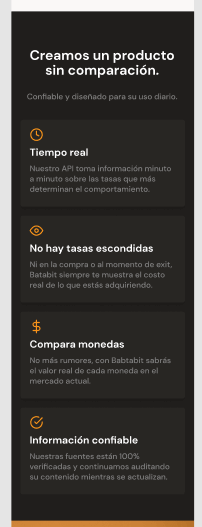
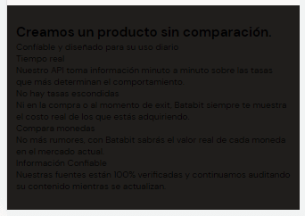
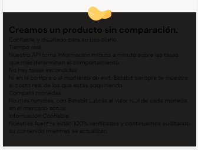
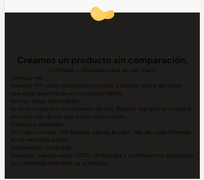
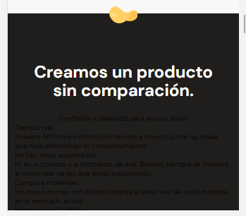
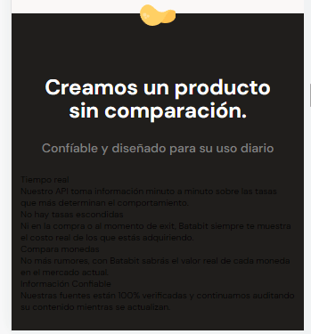

# ESTILOS DE LA SECCIÓN DE BENEFICIOS

En esta clase se empieza con los estilos de la sección de beneficios, comenzando con la sección en general

~~~css
/* Estilos de la sección de beneficios */
.main-product-detail {
    position: relative;
    /* Ancho completo de la pantalla y minimo de 320 px */
    width: 100%;
    min-width: 320px;
    /* La altura es auto para que los elementos den el alto */
    height: auto;
    /* Espacio para que las tarjetas tengan un margen */
    padding: 20px 10px;
    background-color: var(--warm-black);
}
~~~

Se agrega los estilos del logo entre las dos secciones 

~~~css
.product-detail--batata-logo {
    /* Cuando se tiene un position absolute, se debe tener un
    position relative en el contenedor padre */
    position: absolute;
    /* Alto y ancho del logo */
    width: 40px;
    height: 25px;
    /* Posicionamiento de la imagen */
    top: -10px;
    left: calc(50% - 20px);
    background-image: url('../assets/imgs/logo_solo.svg');
}
~~~

Estilos del titulo

~~~css
.product-detail--title {
    width: 90%;
    min-width: 288px;
    height: auto;
    /* Separación entre el contenedor y el contenedor padre */
    margin: 0 auto;
    margin-top: 50px;
    /* Centrado del texto */
    text-align: center;
}
~~~

~~~css
.product-detail--title h2{
    /* Separacion superior */
    margin-bottom: 20px;
    /* Estilos de fuente */
    font-size: 2.4rem;
    font-weight: bold;
    line-height: 2.6rem;
    color: var(--just-white);
}
~~~

~~~css
.product-detail--title p {
    /* Separación inferior */
    margin-bottom: 20px;
    /* Estilos de la fuente */
    font-size: 1.4rem;
    font-weight: 500;
    line-height: 1.8rem;
    color: #808080;
}
~~~

