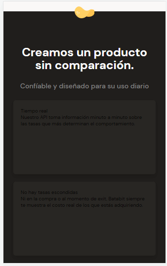
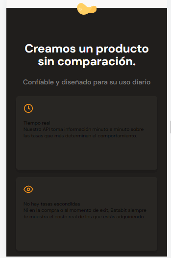
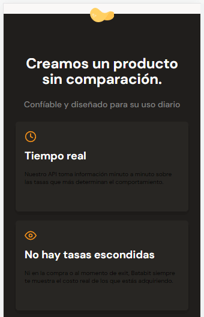
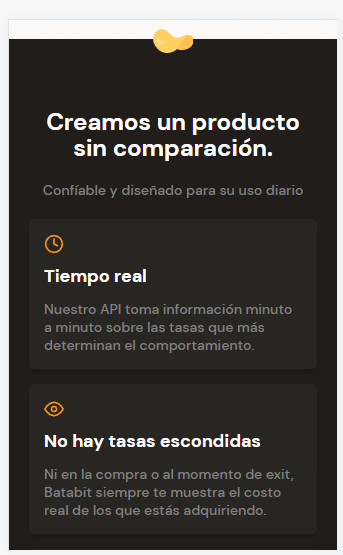

# MAQUETADO TRAJETAS DE BENEFICIOS 

Estilos de la tarjetas de la sección beneficios 

~~~css
.product-detail--card {
    /* Ancho del 90% contenedor con respecto al tamaño de
    pantalla, es de anota que
    ademas se agrega un max-width, debido a que es puede 
    responder a pantallas grandes como por ejemplo una pc */
    width: 90%;
    min-width: 288px;
    max-width: 400px;
    height: 150px;
    margin: 15px auto;
    /* Padding para crear un espacio en los elementos */
    padding: 15px;
    background-color: var(--black);
    /* Redondeo de las tarjetas */
    border-radius: 5px;
    /* Sombreado de la tarjeta */
    box-shadow: 0 4px 8px rgba(0,0,0,0.16);
}
~~~

Estilos en los iconos de las tarjetas

~~~css
.product-detail--card .clock {
    display: inline-block;
    width: 20px;
    height: 20px;
    margin-bottom: 10px;
    background-image: url("../assets/icons/clock.svg");
    /* Ajustar el icono al tamaño del contenedor */
    background-size: cover;
    background-position: center;
    background-repeat: no-repeat;
}

.product-detail--card .eye {
    display: inline-block;
    width: 20px;
    height: 20px;
    margin-bottom: 10px;
    background-image: url("../assets/icons/eye.svg");
    /* Ajustar el icono al tamaño del contenedor */
    background-size: cover;
    background-position: center;
    background-repeat: no-repeat;
}

.product-detail--card .dollar-sign {
    display: inline-block;
    width: 20px;
    height: 20px;
    margin-bottom: 10px;
    background-image: url("../assets/icons/dollar-sign.svg");
    /* Ajustar el icono al tamaño del contenedor */
    background-size: cover;
    background-position: center;
    background-repeat: no-repeat;
}

.product-detail--card .check-circle {
    display: inline-block;
    width: 20px;
    height: 20px;
    margin-bottom: 10px;
    background-image: url("../assets/icons/check-circle.svg");
    /* Ajustar el icono al tamaño del contenedor */
    background-size: cover;
    background-position: center;
    background-repeat: no-repeat;
}
~~~

Estilos en el titulo de las tarjetas

~~~css
.product--card-title {
    margin-bottom: 15px;
    font-size: 1.8rem;
    font-weight: bold;
    line-height: 1.8rem;
    color: var(--just-white);
}
~~~

Estilos en el parrafo de las tarjetas

~~~css
.product--card-body {
    font-size: 1.4rem;
    font-weight: 500;
    line-height: 1.8rem;
    color: #808080;
}
~~~

