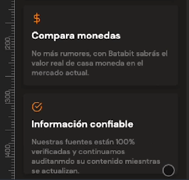
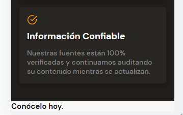

# Maquetando Sección Comodín

En la imagen se puede observar que el texto se ha salido del contenedor en la última tarjeta, a esto se le conoce como un overflow, la forma de solucionar este problema es cambiar el height por un min-height, es decir, pasamos a tener un valor exacto para cada tarjeta a uno en que el minimo es este valor exacto, pero si el contenido dentro de este es mayor se expanda con este contenido. 

El estilo entonces queda como:

~~~css
.product-detail--card {
    /* Ancho del 90% contenedor con respecto al tamaño de
    pantalla, es de anota que
    ademas se agrega un max-width, debido a que es puede 
    responder a pantallas grandes como por ejemplo una pc */
    width: 90%;
    min-width: 288px;
    max-width: 400px;
    min-height: 150px;
    margin: 15px auto;
    /* Padding para crear un espacio en los elementos */
    padding: 15px;
    background-color: var(--black);
    /* Redondeo de las tarjetas */
    border-radius: 5px;
    /* Sombreado de la tarjeta */
    box-shadow: 0 4px 8px rgba(0,0,0,0.16);
}
~~~

Ahora, resuelto el overflow se continua con la sección comodín, el cual en figma se ve como

Se empieza por la estructura del HTML, el cual es muy sencillo

~~~html
<section class="bitcoin-img-container">
            <h2>Conócelo hoy.</h2>
        </section>
~~~

Estilos del contenedor comodín

~~~css
.bitcoin-img-container {
    width: 100%;
    min-width: 320px;
    height: 50vh;
    background-image: url("../assets/imgs/bitcoinbaby1x2.png");
    background-position: center;
    background-size: cover;
    background-repeat: no-repeat;
}
~~~

Estilo del texto en el comodín

~~~css
.bitcoin-img-container h2 {
    padding-top: 60px;
    font-size: 2.4rem;
    font-weight: bold;
    line-height: 2.6rem;
    color: var(--just-white);
    text-align: center;
}
~~~

