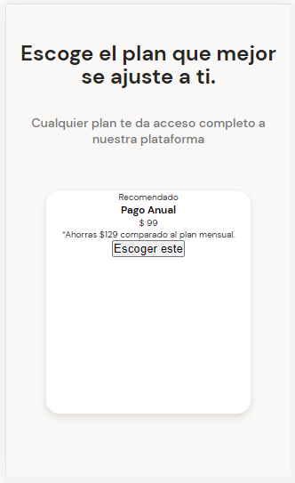

# APLICANDO ESTILOS A LAS TARJETAS DE LA SECCIÓN DE PLANES

Estilos de la tarjeta seccion planes

~~~css
.plans-container--card {
    position: relative;
    width: 70%;
    min-width: 230px;
    max-width: 300px;
    height: 250px;
    margin: 50px auto 0px;
    padding: 0 15px;
    background-color: var(--just-white);
    border-radius: 15px;
    box-shadow: 0 4px 8px rgba(83, 73, 46, 0.16);
}
~~~

