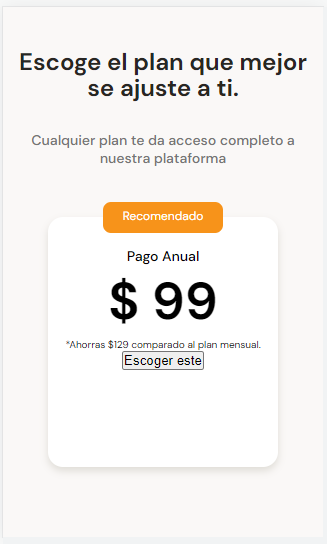

# DETALLANDO ESTILOS EN TARJETAS DE PLANES

Estilo del campo flotante de la tarjeta de la seccion planes

~~~css
.recommended {
    position: absolute;
    width: 120px;
    height: 31px;
    padding: 6px;
    top: -15px;
    left: calc(50% - 60px);
    font-size: 1.2rem;
    background-color: var(--bitcoin-orange);
    border-radius: 8px;
    color: var(--just-white);
}
~~~

Estilos del titulo de la tarjeta de planes

~~~css
.plan-card--title {
    padding-top: 30px;
    font-size: 1.4rem;
    font-weight: 500;
    line-height: 1.8rem;
    color: black;
}
~~~

Estilo de la sección de precios de la tarjeta de planes

~~~css
.plan-card--price {
    padding: 5px 0px;
    font-size: 5.2rem;
    font-weight: bold;
    line-height: 6.3rem;
    color: black;
}
~~~

Estilo del signo pesos del precio tarjeta de planes

~~~css
.plan-card--price span {
    font-size: 1.2rem;
    font-weight: 300;
    vertical-align: text-top;
}
~~~

Estilo párrafo de la tarjeta de planes

~~~css
.plan-card--saving {
    font-size: 1.2rem;
    color: #757575;
}
~~~

