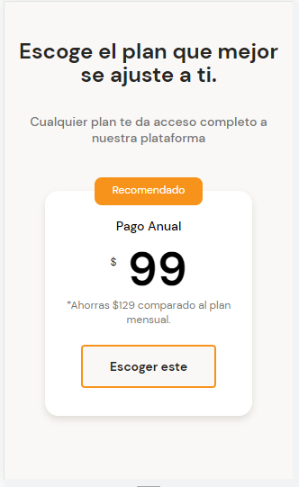
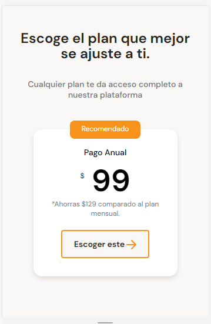

# APLICANDO ESTILOS AL BOTÓN DE CALL TO ACTION

Estilos del boton call to action sección de planes

~~~css
.plan-card--ca {
    width: 150px;
    height: 48px;
    margin-top: 20px;
    background-color: #faf8f7;
    border: 2px solid var(--bitcoin-orange);
    border-radius: 4px;
    font-family: "DM Sans", "sans-serif";
    font-size: 1.4rem;
    font-weight: bold;
    line-height: 1.8rem;
    color: var(--black);
}
~~~

Estilos de la flecha en el botón call to action de la sección planes

~~~css
.plan-card--ca span {
    display: inline-block;
    width: 17px;
    height: 16px;
    background-image: url("../assets/icons/orange-right-arrow.png");
    vertical-align: text-bottom;
}
~~~

