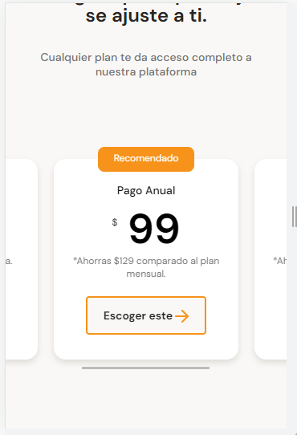

# SCROLL HORIZONTAL CON CSS

Estilos para scroll de las tarjetas de planes

~~~css
.plans-container--slider {
    /* Flex permite que los contenedores se encuentren de 
    forma horizontal */
    display: flex;
    height: 316px;
    /* Se crea un scroll de manera nativa que es un scroll de 
    barra y no un scroll de flecha */
    overflow-x: scroll;
    overscroll-behavior-x: contain;
    scroll-snap-type: x proximity;
}
~~~

Se agrega la línea de scroll-snap-align en la clases .plans-container--card

~~~css
.plans-container--card {
    position: relative;
    /* para que el scroll funcione correctamente se agrega 
    este código */
    scroll-snap-align: center;
    width: 70%;
    min-width: 230px;
    max-width: 300px;
    height: 250px;
    margin: 50px 10px 0px;
    padding: 0 15px;
    background-color: var(--just-white);
    border-radius: 15px;
    box-shadow: 0 4px 8px rgba(83, 73, 46, 0.16);
}
~~~

## Enlaces Externos

- https://caniuse.com/