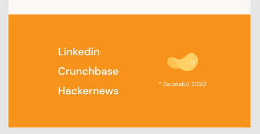
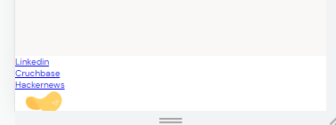
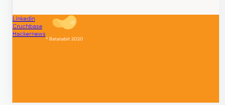
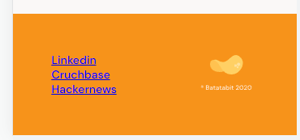
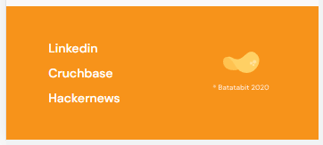

# FOOTER

El diseño del footer es el siguiente:

Esta compuestos por tres hipervinculos y la marca de Batabit. La estructura de HTML queda como:

~~~html
<footer>
    <!-- Section donde esta los hipervinculos -->
    <section>
        <!-- Lista desordenada -->
        <ul>
            <li><a href="#">Linkedin</a></li>
            <li><a href="#">Cruchbase</a></li>
            <li><a href="#">Hackernews</a></li>
        </ul>
    </section>
    <!-- Section donde esta el logo de la compañía -->
    <section>
        
    </section>
</footer>
~~~

Estilos del footer

~~~css
footer {
    /* display flex para poder trabajar las secciones en 
    horizontal */
    display: flex;
    width: 100%;
    height: 150px;
    background-color: var(--bitcoin-orange);
}
~~~

Estilo para acomodar las secciones del footer

~~~css
footer section {
    display: flex;
    width: 50%;
    justify-content: center;
    align-items: center;
}
~~~

Estilo de los hipervínculos

~~~css
footer .left ul {
    font-size: 1.4rem;
    font-weight: 500;
    line-height: 1.8rem;
    list-style: none;
}
.left li{
    margin: 10px 0;
}
.left a {
    text-decoration: none;
    color: var(--just-white);
}
~~~

Hasta este punto ya se tiene todo el diseño realizado para pantallas de mobile, sin embargo, hace falta algunos queries para escalarlo en pantallas mas grandes.