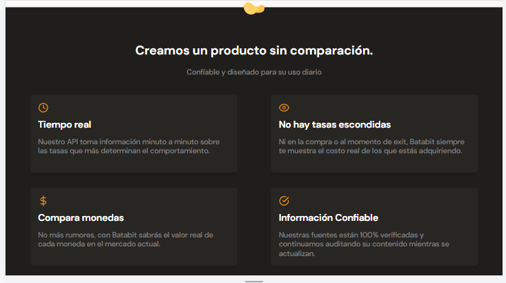
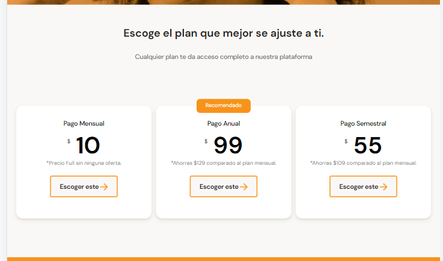

# APLICANDO MEDIA QUERIES

En esta clase se asegura que la página se pueda ver en cualquier dispositivo sin importar el tamaño de la pantalla. Despues de observar en la inspección del navegador de la página, se empieza a ver que el diseño empieza a tener muchos espacios en blanco despues de 930px, por lo tanto este va a ser el breakpoint, es decir el punto donde se cambia el diseño de la página.

Para realizar este cambio se apoya de los media queries, para comenzar se crea una carpeta que para este caso se llamara css y dentro de este un nuevo archivo de estilos CSS llamado tablet.css

Luego este archivo tablet.css se agrega al head del HTML, el cuál se puede observar en la última línea antes de cerrar el head del código

~~~html
<head>
    <meta charset="UTF-8">
    <meta http-equiv="X-UA-Compatible" content="IE=edge">
    <meta name="viewport" content="width=device-width, initial-scale=1.0">
    <title>Document</title>
    <!-- Link de google fonts -->
    <link rel="preconnect" href="https://fonts.googleapis.com">
    <link rel="preconnect" href="https://fonts.gstatic.com" crossorigin>
    <link href="https://fonts.googleapis.com/css2?family=DM+Sans:wght@400;500;700&family=Inter:wght@300;500&display=swap" rel="stylesheet">
    <link rel="stylesheet" href="./styles.css">
    <link rel="stylesheet" href="../css/tablet.css" media="(min-width:930px)">
</head>
~~~

Agregando el nuevo archivo CSS, se le dice al navegador que primero abra los estilos para mobile, sin embargo, si la pantalla supera los 930 px, agregue los estilos para tablet. El archivo tablet.css que como:

~~~css
/* Estilos de las tablas de conversiones */
.main-tables-container {
    display: flex;
    width: 930px;
    margin: 0 auto;
}
/* Estilos de las tarjetas con los beneficios */
.product-cards--container {
    /* Se coloca los elementos de manera horizontal */
    display: flex;
    /* Se evita el overflow horizontal */
    flex-wrap: wrap;
    width: 930px;
    /* Se centra el contenido */
    margin: 0 auto;
}
/* Estilos para centrar las tarjetas de planes */
.plans-container--slider {
    justify-content: center;
}
~~~

