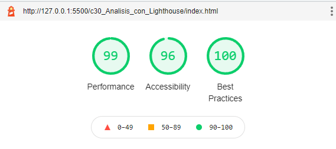

# ANÁLISIS CON LIGHTHOUSE

Lighthouse permite medir ciertos parametros del producto web que se esta creando como temas de accesibilidad, temas de buenas practicas, temas de perfomance y que se puede mejorar.

Dentro de inspeccionar del navegador, en la parte derecha se encuentra la opción de lighthouse

Dentro de este se selecciona las categorias y el dispositivo que se desea analizar, para este caso se desea analizar el perfomance, las buenas practicas y la accesibilidad, comenzando por analizarlos en dispositivos moviles. Se da clic en Generate Report, el cual entrega un reporte del producto web

Lighthouse da recomendaciones para mejorar el producto web, como por ejemplo el tipo de formato de las imagenes, el tamaño de las imagenes.

